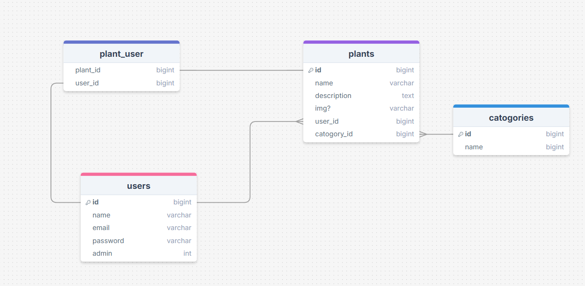

## Donderdag

- project aangemaakt
- project op github gezet

## Maandag 13-10-2025

- ERD gemaakt
- Planning gemaakt
- User stories gemaakt

## Dinsdag 14-10-2025

- Change log aangemaakt.
- plant pagina, route en view aangemaakt.

## Woensdag 15-10-2025

- database plants toegevoegd
- database catogories toegevoegd
- users aangepast met admin key
- plants model aanmaken

## Donderdag 16-10-2025

- details pagina aanmaken en werkend maken

## Dinsdag 21-10-2025

- admin page gemaakt
    - op dit moment aleen een pagina met niks erop
- route admin page gemaakt
    - alleen iemand met de admin mogelijkheid kan naar de admin page
- database bijgewerkt

## Donderdag 24-10-2025

- admin functionaliteit proberen toe te voegen doormiddel van een checkbox (niet gelikt)
- filter knoppen toegevoegd
- dropdown menu
- zoek balk toegevoegd.

## Maandag 27-10-2025

- admin page afgemaakt.

## Dinsdag 18-10-2025

- admin route afgemaakt, alleen de admin kan nu naar de admin pagina.
- delete pagina gemaakt, delete is een soft delete.
